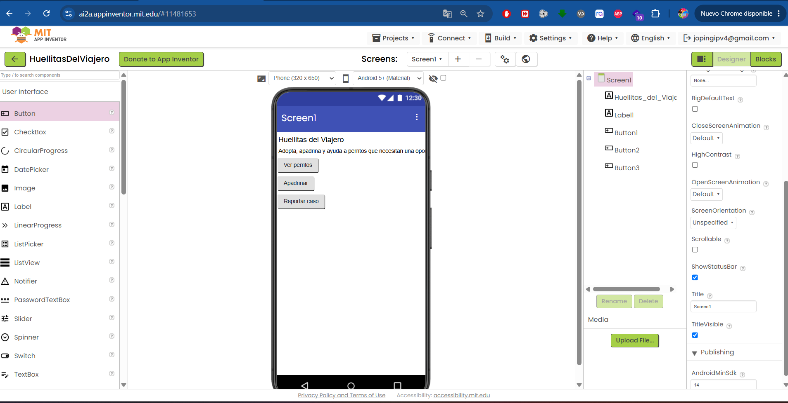

# huellitas-del-viajero
Borrador académico de una aplicación Android para adopción y apadrinamiento de perros en situación de abandono.

### Pantalla de inicio

La pantalla de inicio muestra el propósito principal de la aplicación y permite acceder a las funciones principales: consultar perritos, apadrinar y reportar casos.

*Figura 1. Diseño inicial de la pantalla de inicio, elaborado por mí en MIT App Inventor.*

