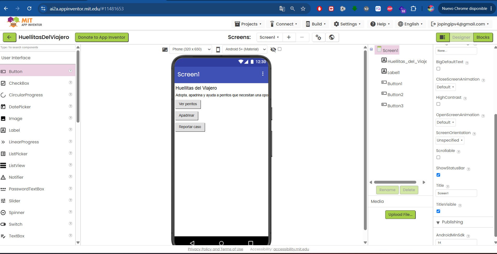

# Huellitas del Viajero

Proyecto académico de aplicación Android orientada a conectar a personas interesadas en conocer, apadrinar o ayudar a perros en situación vulnerable. Esta versión es un prototipo de demostración: no publica casos reales ni recibe solicitudes de ayuda.

## Origen del proyecto

En los módulos anteriores elaboré en MIT App Inventor un wireframe de la pantalla principal para definir el propósito de la aplicación y sus tres opciones: **Ver perritos**, **Apadrinar** y **Reportar caso**. En el Módulo 5 tomé ese diseño como referencia para iniciar una implementación nueva en Android Studio con Kotlin y Jetpack Compose. El proyecto de App Inventor no se convirtió automáticamente al nuevo entorno.

### Pantalla de inicio

La pantalla de inicio muestra el propósito principal de la aplicación y permite acceder a las funciones principales: consultar perritos, apadrinar y reportar casos.

*Figura 1. Diseño inicial de la pantalla de inicio, elaborado por mí en MIT App Inventor.*

## Avance del Módulo 5

La aplicación ya se compiló, instaló y ejecutó en un emulador Pixel 7. En las pruebas visuales del prototipo se observaron las siguientes pantallas y recorridos:

- **Inicio:** presenta el propósito de Huellitas del Viajero y permite acceder a Ver perritos, Apadrinar y Reportar caso.
- **Perritos rescatados:** muestra tres perfiles ficticios de demostración —Firulais, Luna y Rocky— con información básica y la opción «Ver detalle».
- **Detalle de perrito:** se creó una vista para consultar cada perfil; su contenido y navegación deben seguirse probando antes de tratarlo como un flujo finalizado.
- **Apadrinar:** se incorporó una pantalla informativa; todavía no se gestionan apadrinamientos reales.
- **Reportar caso:** incluye campos para la descripción y una ubicación de referencia, además del botón «Guardar reporte». Los datos no se envían a internet ni se conservan de forma permanente.

El objetivo de esta etapa fue pasar de una idea representada en un wireframe a una aplicación Android navegable. Los nombres y datos de los perritos son ficticios; no corresponden a animales disponibles para adopción.

## Estado y limitaciones

Esta versión es exclusivamente académica. Las capturas muestran la interfaz y las pantallas probadas, pero no demuestran por sí solas todas las reglas internas del formulario. Antes de afirmar que la validación funciona por completo, falta comprobar y documentar, como mínimo, el intento de guardar campos vacíos y el comportamiento al ingresar datos de prueba.

No hay una base de datos local o remota conectada para mantener reportes entre sesiones, ni un canal activo que los entregue a un rescatista u organización. Por eso, el botón «Guardar reporte» no debe interpretarse como una solicitud de ayuda real.

## Registro de cambios

### Antes del Módulo 5 — Diseño inicial

- Se definió la idea y el propósito de Huellitas del Viajero.
- Se elaboró el wireframe de inicio en MIT App Inventor.
- Se plantearon las opciones Ver perritos, Apadrinar y Reportar caso.

### Módulo 5 — Implementación Android

- Se creó un proyecto nuevo en Android Studio con Kotlin y Jetpack Compose a partir del wireframe anterior.
- Se implementó la pantalla de inicio y la navegación inicial entre las opciones principales.
- Se agregó una lista de tres perfiles ficticios con acceso a vistas de detalle.
- Se incorporó una pantalla informativa de apadrinamiento y un formulario inicial para reportar casos.
- Se compiló y ejecutó el prototipo en el emulador Pixel 7.

### Próximos módulos — Trabajo previsto

- Completar y documentar las pruebas de navegación y validación de formularios.
- Implementar almacenamiento persistente y comprobar la recuperación de los datos al reiniciar la aplicación.
- Desarrollar el flujo de apadrinamiento sin presentar solicitudes de demostración como reales.
- Mejorar accesibilidad, diseño y manejo de errores.
- Utilizar imágenes y casos reales únicamente cuando exista autorización y un procedimiento de verificación.
- Publicar el código y el README actualizados en el repositorio indicado por GitHub Classroom antes del Módulo 7 y preparar la entrega final del Módulo 8.

## Cómo revisar el prototipo

Para revisar el prototipo, abra android/HuellitasDelViajero en Android Studio, espere la sincronización de Gradle, seleccione un emulador Android y ejecute la configuración app. Durante el avance del Módulo 5 se utilizó un Pixel 7 virtual.
